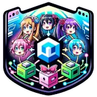

# Home

## About the plugin

Clipboard Connect is a dynamic plugin for Minecraft, enabling the synchronization of WorldEdit clipboards across multiple servers using Redis. This tool streamlines the process of transferring builds and structures between servers, facilitating collaboration and efficient project management in Minecraft communities.

## Links

* [Download ClipboardConnect](https://modrinth.com/plugin/ClipboardConnect)
* [Discord](https://discord.gg/intellectualsites)
* [Issues & Feature](https://github.com/IntellectualSites/ClipboardConnect/issues)