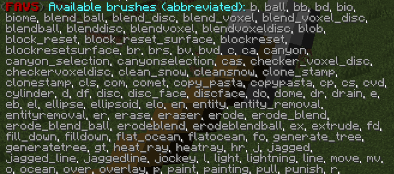
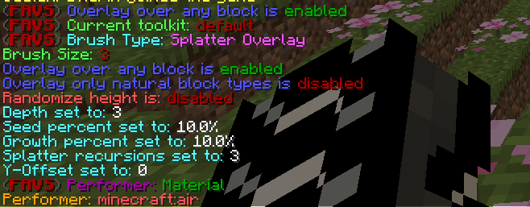

# These are the Voxel Sniper commands
## VoxelSniper Default Commands

---
### Reset your Vox

This command is to reset your brush settings

**Usage:** `/d`

**Aliases:** none

**Permissions:**

Primary:


When you are new to VoxelSniper, be in the habit of using this after every job, especially if you are doing heavy terraforming where one click can cause a big mess to clean up.

---

### VoxelSniper Settings

This command will give you a printout of all of VoxelSniper's current settings, letting you check them over before you pull the trigger.

**Usage:** `/vs`

**Aliases:** `[voxelsniper,favs,fastasyncvoxelsniper]`

**Permissions:**

Primary:


Replace and ink information is only displayed on applicable brushes. If you're not seeing them, make sure you are using the proper brush!  /vs brushes Brush List. This command returns all of VoxelSniper's brush options.


---

### **vs brusheslong**

Brush long-name List. This command will give you the long-name versions of the brushes.

**Usage:** `/vs brusheslong`

**Aliases:** `[voxelsniper brusheslong, fastasyncvoxelsniper brusheslong]`

**Permissions:**

---

### **vs brushes**

Brush short-name List. This command will give you the short-name versions of the brushes.

**Usage:** `/vs brushes`

**Aliases:** `[voxelsniper brushes, fastasyncvoxelsniper brushes]`

**Permissions:**

Primary:

---

### **vs perf**

Performer List. This command returns all of VoxelSniper's Performer options in short names.

**Usage:** `/vs perf`

**Aliases:** `[voxelsniper perf, fastasyncvoxelsniper perf]`

**Permissions:**

Primary:

---

### **vs perflong**

Performer long-name List. This command will give you the long-name versions of the performers.

**Usage:** `/vs perflong`

**Aliases:** `[voxelsniper perflong, fastasyncvoxelsniper perflong]`

**Permissions:**

Primary:

## Brush

---

### **/b [instructions]**

The brush command is the gateway to the VoxelSniper box of world-editing wonders. This command can be as simple  as changing the active brush type, its size, or to issue a string of instructions (such as the Erosion Brush's settings). Many brushes behave wildly differently depending on the settings you've loaded into your Sniper's Brush, so make sure you know what variables you are working with before pulling the trigger!

**Usage:** `/b [instructions]`

**Aliases:** None

**Permissions:**

Primary:


Each brush has its own in-game manual! To access this, we just ask VoxelSniper for "info" on that particular brush



`/b b info` - will give you information on the Ball Brush.



The name of your favorite brushes may have changed from VS4 to VS5, make sure to read the section on Performers below.


---

## Performer

You use **/v m** to set the performer for a brush. The m is a placeholder for your blocks or patterns you want to use on a brush.
Example below:

**Aliases:**

**Permissions:**


This part of documentation might be outdated or won't work like explained right now!



A "plain" ball brush is **/b b m** (the m stands for material)



An "ink" ball brush is **/b b i** (the i stands for ink)



Some brushes, such as the erosion brush or the monster brush, do not use Performers as it would not augment their functionality.


* To replace a ball of stone with a ball of dirt, use `/b b mm`
    * The first m means that you are only placing a material, just like in the disc examples. Just like before, you'd need to `/v dirt` for this. The second m means that you are only replacing a material - likewise you'd need to `/vr stone` for this.
* To replace a ball of stone with a ball of redwood log, use `/b b cm`
    * The c means that you are placing both a material (`/v log`) and a data (`/vi 1`), the m means that you are replacing just a material(`/vr stone`)
* To rotate a collection of cobblestone stairs and wooden stairs (all with data 2) to face a different direction (data 3) without disturbing that data 10 cloth right next to it, use `/b b ii`
    * The first i indicates that you are placing data (`/vi 3`) and the second i indicates that you are replacing only a specific ink (`/vir 2`)
* To snipe in a still water block, use `/b s mp`
    * The m means that you are placing a material (`/v 9`) and the p means that no-physics will be engaged for erosions. It may help to think of this parameter as half of the overall "brush strength".
* `rf[#]` - The number of recursions the brush will perform for filling.


Always start small with recursions, and work your way up if needed! Re-sniping in a different location with a weaker brush can yield a better result than using a stronger brush in fewer locations!


* `b[#]` - Brush Size. (example: b23)


The ideal sizes for erosion brushes tended to run between 8-20. Larger brushes are far more clumsy and often yield unwanted results.  


---

## Anatomy of an Instruction Set
Let's take a look at how these variables get the desired effect from  the Erosion Brush's "melt" preset. The preset's instructions look like this:

`/b e e2 f5 re1 rf1 b10.`

**Aliases:** none

**Permissions:**

* **e2** - Our brush will be eroding blocks with 2 or more exposed faces. This means that only blocks that are well-embedded within the landscape will be eroded, giving us that "wither" to the landscape we want.
* **f5** - New blocks will only be created if what has been eroded has created a block space with 5 covered faces. This is just to keep things a bit smoother as we melt our landscape away.
* **re1** - This is our brush strength parameter for erosion. The melt brush repeats its erode function in the assigned area once.
* **ref** - This is our brush strength parameter for filling. The melt brush repeats its fill function in the assigned area once.


Note how powerful the melt brush is with just *one* recursion!


---

## The Random-Erode Brush
The downside to the normal erosion brush is that, with repeated usage, an area can become too perfectly smooth. The landscape,  for example, can look more like melted wax than dirt and stone. This  randomized variant produces similar results without generating these  inorganic features.
On each click, the four erosion parameters are randomized. This brush is also easier to use, as it uses the regular brush size variable. 

Usage: `/b re`

**Aliases:**

**Permissions:**


The **arrow tool* variant of the brush favors erosion while the **gunpowder tool** version favors fill.


**Example with arrow:**

**Example with gunpowder:**

---

## The Overlay / Topsoil Brush

The overlay brush paints over existing landscape.

Usage: `/b over d[#]:` 
The Overlay Brush will "spray-paint" the top  most blocks in its area to the blocktype set by your "/v" command. This  can be used to easily clean up any exposed materials once you are done  with the erosion brush, or to create new fill material two link two pieces of landscape together.

Usage: `/b over info:`

**Aliases:** 

**Permissions:**


By default, this brush will only paint over "natural" materials (stone, dirt, gravel, grass, trees, ores, etc)


The area to the covered bit by the Overlay Brush is defined by the brush size variable.
When using this brush, The arrow tool will "spray down" onto the topmost blocks of the spray zone.

**/b over all** will set the brush to paint over all material types.
You can return to "natural" mode with **/b over some**. overlay brush is sprayed near them.


**/b over d5 + /v 12 + /b 20 + /b over all** will be a substantial "desert maker" brush that will demolish any structures in its wake using the arrow tool.


---

## Splatter Overlay Brush

This brush combines the functions of the Splatter and Overlay Brushes.

Usage:  `/b sover s[#] g[#] r[#]`

**Aliases:**

**Permissions:**

 What you see through /b sover info: 

The `/v` Voxel Select value is used to paint in, as an overlay brush would, using the seed (s), growth (g) and recursion (r) of the splatter.

---

## Underlay Brush
The Underlay is essentially the opposite of the Overlay Brush and will paint the ceilings of caves and buildings by your **/v** command. The (d) variable determines the depth of the brush. This will be how high you want the brush to penetrate

Usage:  `/b under d[#]`

**Aliases:** 

**Permissions:**

---

## Blend Brushes

This suite of brushes allows the sniper to clean up ragged borders  between different types of materials. 
The brush looks at the neighboring blocks of each block in the brush's area of effect to determine which  material is the most common neighbor. 
If the brush can find a most common neighboring material for a given voxel (this excludes ties), 
that voxel is changed to better match the surrounding blocks.

The user may choose to either include or exclude air in this search:

By using the **arrow tool**, air is included, so repeated uses of these brushes are likely to act similarly to the melt and smooth presets of the erosion brush. 

On the other hand, excluding air (by using the **gunpowder tool** will make repeated uses of the blend brushes act more like the fill preset of the erosion brush. 

Additionally, water may also be optionally included or excluded (default). 

Blend brushes use standard brush size and several available sized shapes:

**Usage:**
* `/b bd`: Blend Disc
* `/b bb`: Blend Ball
* `/b bvd`: Blend Voxel Disc
* `/b bv`: Blend Voxel
* `/b bb water`: Blend Ball, toggles water exclusion

**Aliases:**

**Permissions:**

---

## The Drain Brush

The drain brush removes all liquid (water or lava) in a ball shape using the standard brush size variable.

Usage: `/b drain`:

* */b drain d*: Toggles the shape of the brush to be a disc.
* */b drain true|false*: Uses either the true sphere algorithm or the normal one.

**Aliases:**

**Permissions:**