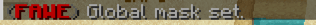

## Introduction

In some cases you want to exclude regions because you don't want to edit them, 
for example when the unwanted part is inside another wanted part.
In this example we use the [WorldEditSUI plugin](https://www.spigotmc.org/resources/worldeditsui-visualize-your-selection.60726/) (is optional, but can help to understand each step) to visualize the selections.

 This example is a cuboid selection with a y height of 1 on a plot, you can use different selection types, heights and also you can use it on a normal world 

### Step-by-step Tutorial

1. Select inner region with `//pos1` and `//pos2` or left and right-click interaction while holding the ``//wand``item.

2. Add a gmask containing your selection with `//gmask !#region`

3. Select outer region using the same commands as in ``1.`` (or outset/expand/move/wer etc.)

4. Run the command of your choice and the inner region will not be affected, in this example we used ``//set stone``
