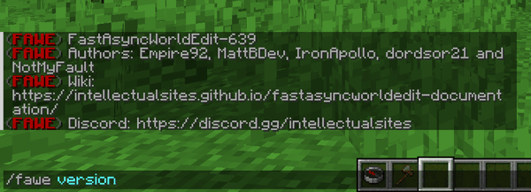

# Administrative Commands

## Version

This can be used to display the installed FAWE version.

**Usage:**
`/fawe version`

**Visual Example:**



## Threads

This command print all thread stacks. As the output is very long, it is best used via the console.

**Usage:**
`/fawe threads`

**Permissions:**
`worldedit.threads`

**Example:**

```
[15:34:08] [AsyncNotifyKeyedQueue - 1/INFO]: --------------------------------------------------------------------------------------------
[15:34:08] [AsyncNotifyKeyedQueue - 1/INFO]: Thread: Async Tab Complete Thread - #2 | Id: 133 | Alive: true
[15:34:08] [AsyncNotifyKeyedQueue - 1/INFO]: java.base@17.0.1/jdk.internal.misc.Unsafe.park(Native Method)
[15:34:08] [AsyncNotifyKeyedQueue - 1/INFO]: java.base@17.0.1/java.util.concurrent.locks.LockSupport.park(LockSupport.java:341)
[15:34:08] [AsyncNotifyKeyedQueue - 1/INFO]: java.base@17.0.1/java.util.concurrent.locks.AbstractQueuedSynchronizer$ConditionNode.block(AbstractQueuedSynchronizer.java:506)
[15:34:08] [AsyncNotifyKeyedQueue - 1/INFO]: java.base@17.0.1/java.util.concurrent.ForkJoinPool.unmanagedBlock(ForkJoinPool.java:3463)
...
```

## Reload

This reloads the plugin with the latest configuration.

**Usage:**
`/fawe reload`

**Permissions:**
`worldedit.reload`

## Timezone

Change the time zone for the internal time definition of FAWE. This command assists player to measure the time correctly 
to recover the snapshots. The time is used in particular for snapshots, as these are saved and assigned with a time specification.

**Usage:**
`/fawe tz <timezone offset>`

- The default time is [UTC](https://en.wikipedia.org/wiki/Coordinated_Universal_Time). The offset defines the hours that are added / subtracted (e.g. `+1` or `-2`).

**Visual Example:**


## Debugpaste

Generate and upload basic server information, the last server-log and snapshots from the FAWE configuration to 
https://athion.net/ISPaster/paste for a faster technical support. This information is important for identifying customer 
mistakes or technical problems and replicating bugs.


To minimize the publication of personal data from your players and to exclude dependency problems with other external plugins from the beginning, the final bug test and `/fawe debugpaste` output should be from a test server.


**Usage:**
`/fawe debugpaste`

**Permissions:**
`worldedit.debugpaste`

## WorldEditAnywhere

Toggle your bypass for region restrictions.

**Usage:**
`//wea`

**Aliases:**
`//worldeditanywhere`

**Permissions:**
`fawe.admin`