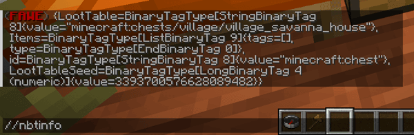
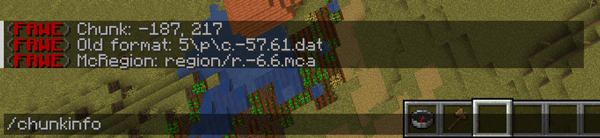
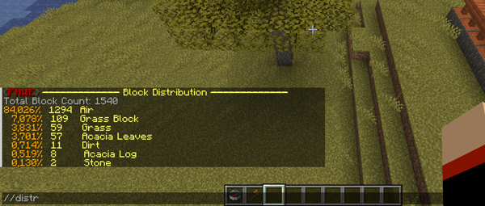
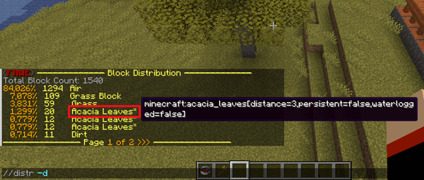
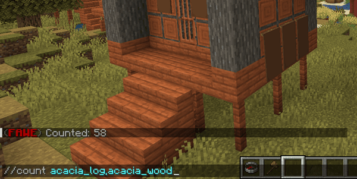
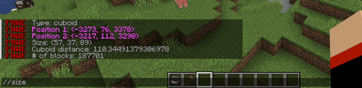
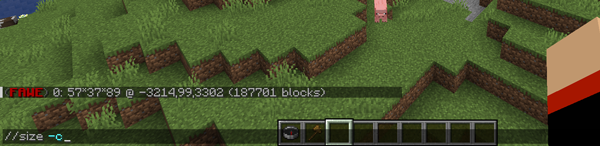
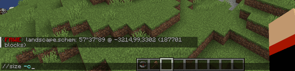

# Analysis Commands

## Nbtinfo

Displays the NBT info for the target block in your [crosshair](https://minecraft.wiki/w/File:HUD_example.png) in the form of a user-friendly string (plain-text).

The "Named Binary Tag" (NBT) is a format used to store data in a tree structure made up of various tags in Minecraft. More information regarding the NBT format can be found [here](https://minecraft.wiki/w/NBT_format).

**Usage:**
`//nbtinfo`

**Permissions:**
`worldedit.nbtinfo`

**Visual Example:**

## Chunkinfo

With this command you get information about the [chunk](https://minecraft.wiki/w/Chunk) you are inside.

- The first line display the X and Z coordinate of your chunk.
- The two other lines display the chunk files name.

More information regarding the Region file format can be found [here](https://minecraft.wiki/w/Region_file_format).


With the client short-key `F3 + G` you see the chunk border.


**Usage:**
`//chunkinfo`

**Permissions:**
`worldedit.chunkinfo`

**Visual Example:**

## Distr

This command gets the distribution of blocks in the selection with the percentage distribution, the count and the name 
of this block translated in your minecraft client language.

With a mouse-over above the block names you see the technical names (e.g. "minecraft:acacia_leaves") and with using of the 
`-d` flag the block values in squared brackets too (picture 2).

**Usage:**
`//distr [-cd] [-p <page>]`

- You can analyze the block distribution of your clipboard (e.g. after a `//copy` command) instead of your selection with using of the `-c` flag.
- With the `-d` flag the block list will separate all blocks with different blocks values.
- With the optional `-p` flag and a side number you switch between the list side.

**Permissions:**
`worldedit.analysis.distr`

**Visual Example:**

## Count

With this command you get the count of a certain type of block in your selection. Entities cannot be counted with this.

**Usage:**
`//count <mask>`

- You can search a block with a specify bock value with using of the squared brackets (e.g. `acacia_log[axis=x]` or `rose_bush[half=upper]`)

**Permissions:**
`worldedit.analysis.count`

**Visual Example:**

## Size

With this command you get different measurements and other info about your selection.

The level of detail in the output depends on the analysis source:

### Analyzing a selection

1.  selection-type
2.  type specific selection-infos
3.  max. size of length, height and width
4.  diagonal distance in block-length
5.  amount of blocks (with `AIR`)

### Analyzing a clipboard

1.  clipboard-list number
2.  cuboid size of length, height and width
3.  position of your copy
4.  amount of blocks (with `AIR`)

### Analyzing a schematic

1.  schematic name
2.  cuboid size of length, height and width
3.  position of your copy (if available)
4.  amount of blocks (with `AIR`)


Note, that a schematic always has a cuboid form.


**Usage:**
`//size [-c]`

- You can analyze the block measurements of your clipboard / schematic (e.g. after a `//copy` command) instead of your selection with using of the `-c` flag.

**Permissions:**
`worldedit.selection.size`