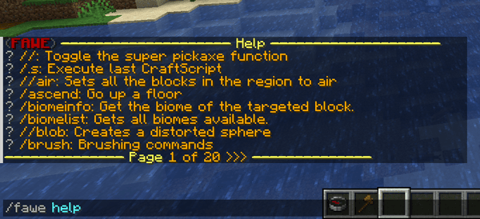

# Basic Commands

## Help

Use this command to get the internal command help from FAWE with command descriptions and the syntax.

**Usage:**
`/fawe help [-s] [-p <page>] [<command...>]`

- With `-s` you get a list with all sub-commands of the specified main command.

**Aliases:**
`//help`

**Permissions:**
`worldedit.help`

**Visual Example:**

## Confirm

If certain WorldEdit actions are too large or require special care, you will be asked for confirmation. This should be used very carefully.

**Usage:**
`//confirm`

**Permissions:**
`fawe.confirm`