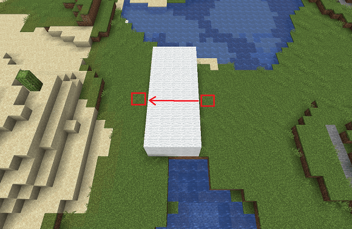

# Navigation Commands

## Jumpto

With this command you teleport you to a specific position.

To prevent a stuck you will teleport upstairs of the next solid block in the vertical with two free blocks in the
height for a place to stay.

**Usage:**
`//jumpto [-f] [<world>,<x>,<y>,<z>]`

- By default, the target position is the [crosshair](https://minecraft.wiki/w/File:HUD_example.png) you are looking.
- Alternative, you can define the target position with `<world>,<x>,<y>,<z>`.

**Aliases:**
`//j`

**Permissions:**
`worldedit.navigation.jumpto.command`

**Visual Example:**

## Unstuck

With this command you can escape from being stuck inside a block.

Similar to `//jumpto`, you will teleport to the nearest solid block above (vertically) that also has two air blocks above it.

**Usage:**
`//unstuck`

**Permissions:**
`worldedit.navigation.unstuck`

## Thru

With this command you pass through walls in your [crosshair](https://minecraft.wiki/w/File:HUD_example.png) direction.

For this command you have to standing before a wall. The maximum teleport distance are 6 blocks. Thus, the wall may
be up to 5 blocks deep.

**Usage:**
`//thru`

**Permissions:**
`worldedit.navigation.thru.command`

**Visual Example:**

## Ascend

With this command you can teleport you up a specified amount of floors.

You will teleport upstairs of the next solid block in the vertical which has two air blocks above it for a place to stay.
The distance between the floors are irrelevant.

**Usage:**
`//ascend [levels]`

- With the `levels` argument, you specify the amount of floors to which you are teleported up. Without this argument, the `level` is "1".

**Permissions:**
`worldedit.navigation.ascend`

**Visual Example:**

## Descend

With this command you can teleport you down a specified amount of floors.

You will teleport downstairs to the next solid block in the vertical which has two air blocks above it for a place to stay.
The distance between the floors are irrelevant.

**Usage:**
`//descend [levels]`

- With the `levels` argument, you specify the amount of floors to which you are teleported down. Without this argument, the `level` is "1".

**Permissions:**
`worldedit.navigation.descend`

**Visual Example:**

## Up

With this command you can teleport you upwards your specified `distance`.

**Usage:**
`//up [-fg] <distance>`

- By default, you will stand on a glass block to keep you still.

**Permissions:**
`worldedit.navigation.up`

**Visual Example:**

## Ceil

With this command you can teleport you under the closest ceiling above you.

**Usage:**
`//ceil [-fg] [clearance]`

- By default, you will stand on a glass block to keep you still.
- With the `clearance` option you can specify a distance between your head and the ceiling. The default distance is 0, so you won’t have any clearance above your head.

**Permissions:**
`worldedit.navigation.ceiling`

**Visual Example:**

