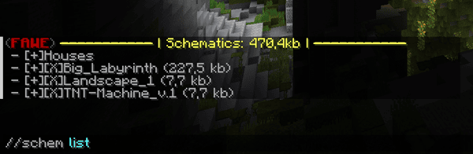

# Schematic Commands

FAWE allows you to copy built content and save it as a separate files so that it can be transferred to other computers 
/ worlds / servers or provided as a download on other external web platforms. The default file format is the "Schematic-Format" 
(".schem") by WorldEdit and FAWE.

## Schematic

This is the main command to handle the schematics.

**Usage:** `//schematic ...`

**Aliases:**
`//schem`

## Schematic List

This command lists your schematics and schematic folders.

**Usage:** `//schematic list [-dn] [-p <page>] [-f <formatName>] [filter or directory]`

- You can sort the schematic list by the date of creation: With the `-n` flag the list starts with the newest schematic, while with `-d` the list begins with the oldest.
- With the optional `-p` flag and a side number you switch between the list side.
- With `-f` you filter your results with the target schematic file format.
- A search string (the `filter`) can be used to search for special files or folders based of the name (including the file extension). The filter is case-insensitive. Alternative, you can list all contents of the target folder by specify a `directory` (e.g. `//schematic list Houses/`).

**Permission:** `worldedit.schematic.list`

**Visual Example:**

## Schematic Move

This command can be used to move the [loaded schematic](#schematic-load) to the specified folder.

**Usage:** `//schematic move <directory>`

- Specify the target folder with the `directory` argument. The path structure starts with the personal main folder, followed by the file separator (depending on the operating system), the subfolder and so on.

**Permission:** `worldedit.schematic.move` & `worldedit.schematic.move.other`

**Visual Example:**

