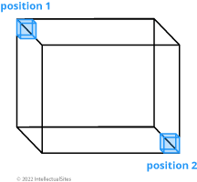
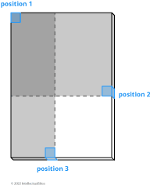
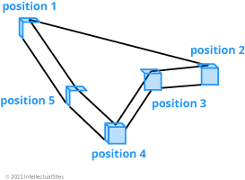
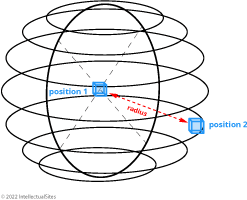
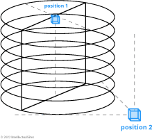
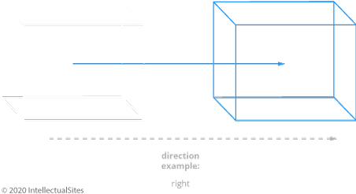

# Selection Commands

## Sel

Some FAWE commands require a region selection to designate what will be modified. This command allows you to amend and or remove your current selection.

**Usage:** `//sel [-d] [selector]`

- Without any arguments you deselect your current region selection.
- The `selector` argument is used to change the selection shape (= selection type).
- With `-d` you change your default selection type.

**Aliases:** `[ deselect, desel, /; ]`

**Permission:** `worldedit.analysis.sel`

### Selection-Types

#### Cuboid

This most commonly used selection and is the **default type**. The cuboid selection requires two points to be defined.

#### Extend

This is an advanced version of the cuboid selection. After the first two points are defined, the selection can be 
expanded by defining even more point. The final selection will remain a cuboid.

#### Poly

With this type you get a geometrical selection with a free polygonal border. The height of the polygon is determined 
by the Y-coordinate of the highest and lowest positions. An infinite amount of points can be defined. The border 
connects all corners and is sorted by an incrementing number.

#### Ellipsoid

In this selection, your region is an ellipsoid. The `position 1` argument defines the mid-point, the `position 2` 
argument is used to alter the length, width and height of the ellipsoid.

#### Sphere

This selection yields a spherical region. The `position 1` argument defines the mid-point and the `position 2` argument 
defines the radius.

#### Cyl

The selection type produces a cylindrical selection. The `position 1` argument defines the mid-point of the cylinder 
and the `position 2` argument define both the radius and the depth (height) of the cylinder. Only vertical circular 
cylinder are possible.

#### Polyhedron

Alias: "Convex" and "Hull"

With this selection type you get anfree polygonal selection. In different of the `poly` selection, the height isn’t determined.

#### Fuzzy

Alias: "Magic"

This selection type select all blocks from the same material of your marked block. So if you click at an `orange_wool` 
block all `orange_wool` blocks in the next near without one block distance are selected.

- With a left-click you choice the first block / the first material. With the following right-click you add it to your choice.
- It checks the neighbor blocks with a pathfinder (top, bottom, side-blocks for each block separately) so it doesn't need a radius argument.

## Wand

With this command you get the FAWE [Tool Item](../../tool-items/tool-items.md).

**Usage:** `//wand [-n]`

- First, you get the [Wand Tool Item](../../tool-items/tool-items.md#wand-tool-item).
- With `-n` you also get the [Navigation Tool Item](../../tool-items/tool-items.md#navigation-tool-item).

**Permission:** `worldedit.wand`

## Pos1 and Pos2

A different way to define the selection corner is through the use of the `//pos` commands. If no parameters are specified, 
the position will be set to the coordinate your standing in (picture). Alternatively, you can define the coordinates 
explicitly with the `coordinates` argument. The argument follows this syntax: `<X>,<Y>,<Z>` or `<one value for X, Y and Z>`.

**Usage:** `//pos1 [coordinates]` and `//pos2 [coordinates]`

**Aliases:** `//1` and `//2`

**Permission:** `worldedit.selection.pos`

**Visual Example:**

## Hpos1 and Hpos2

This is the third way to define the selection corner. This will select the next solid block in your [crosshair](https://minecraft.wiki/w/File:HUD_example.png).

**Usage:** `//hpos1` and `//hpos2`

**Permission:** `worldedit.selection.hpos`

**Visual Example:**

## Chunk

This command changes your selection type to the `cuboid` selection type and selects all the blocks in a given [chunk](https://minecraft.wiki/w/Chunk).

**Usage:**

`//chunk [-cs] [coordindates]`

- Without arguments, the chunk you are currently located in will be selected.
- The target chunk can be explicitly defined by either passing a block’s `x`, `y` and `z` coordinate.
- Or by passing valid [chunk coordinates](https://minecraft.wiki/w/Chunk#Finding_chunk_edges) alongside the `-c` flag.
- The `-s` flag allows you to re-select all chunks of your current selection. In this case, no coordinates have to be specified.

**Permission:** `worldedit.selection.chunk`

## Shift

With the shift command you can shift your selection. In different of the `//move` command you shift not any blocks (see picture).

**Usage:**

_Primary:_

`//shift <amount>`

- With the `amount` argument your specify the amount of block which are moved in the direction.
- A negative `amount` will invert your shift direction.

_Secondary:_

`//shift <amount> [direction]`

- To define your target direction, look to the direction or use the `direction` argument.


The list of valid direction arguments you find [here](../commands.md#direction-argument).


**Permission:** `worldedit.selection.shift`

**Visual Example:**

## Inset

With this command your decrease your selection.

**Usage:**

_Primary:_

`//inset <amount>`

- Without any flags, your decrease your selection with the same amount by all sides (see picture).

_Secondary:_

`//inset [-hv] <amount>`

Alternatively, the decrease can be explicitly defined by:
- The `amount` of block for the horizontal line alongside the `-h` flag.
- The `amount` of block for the vertical line alongside the `-v` flag.

**Permission:** `worldedit.selection.inset`

**Visual Example:**

## Outset

With this command your increase your selection.

**Usage:**

_Primary:_

`//outset <amount>`

- Without any flags, your increase your selection with the same amount by all sides (see picture).

_Secondary:_

`//outset [-hv] <amount>`

Alternatively, the increase can be explicitly defined by:
- The `amount` of block for the horizontal line alongside the `-h` flag.
- The `amount` of block for the vertical line alongside the `-v` flag.

**Permission:** `worldedit.selection.outset`

**Visual Example:**

## Contract

Comparable to the `inset` command your can decrease your selection - but at here for a specify direction. So the 
decrease will only execute for one or two sides (see picture).

**Usage:**

_Primary:_

`//contract <amount> [direction]`

- With the `amount` argument your specify the amount of block which are decreased.
- To define your target direction, look to the direction or use the `direction` argument.


The list of valid direction arguments you find [here](../commands.md#direction-argument).


_Secondary:_

`//contract <amount> <reverse-amount> [direction]`

- A second `reverse-amount` will increase the selection for the inverted side.

**Permission:** `worldedit.selection.contract`

**Visual Example:**

## Expand

Comparable to the `outset` command your can increase your selection - but at here for a specify direction. So the 
increase will only execute for one or two sides (see picture).

**Usage:**

_Primary:_

`//expand <amount> [direction]`

- With the `amount or "vert"` argument your specify the amount of block which are increased.
- To define your target direction, look to the direction or use the `direction` argument.
- With the shortest specification of the expand command `vert`, the selection will increase for all blocks in the vertical line of the world.


The list of valid direction arguments you find [here](../commands.md#direction-argument).


_Secondary:_

`//expand <amount or "vert"> <reverse-amount> [direction]`

- A second `reverse-amount` will decrease the selection for the inverted side.

**Permission:** `worldedit.selection.expand`

**Visual Example:**

