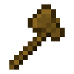

# Tool Item

## Navigation Tool Item

One way of teleporting you with FAWE is through the use of a "navigation-item". By default, this is the
vanilla `compass`. The item is changeable in the `worldedit-config.yml`:

```yaml
navigation-wand:
  item: minecraft:compass
  max-distance: 100
```

With left-click you executing the [Jumpto](../commands/navigation/navigation.md#jumpto) command, and with right-click your executing the [Thru](../commands/navigation/navigation.md#thru) command.

The FAWE tool items (inclusive the navigation tool) can be obtained e.g. via the normal creative inventory or with the `//wand -n` command (see [Wand](../commands/selection/selection.md#wand)).

**Permissions:**
- `worldedit.navigation.jumpto.tool`
- `worldedit.navigation.thru.tool`


## Wand Tool Item

Positions are defined in various ways. One of these ways is through the use of a "wand-item". By default, this is the
vanilla `wooden_axe`. The item is changeable in the `worldedit-config.yml`:

```yaml
wand-item: minecraft:wooden_axe
```

Left-clicking a block with this wand-item defines the primary position (aka "pos1") and right click defines the secondary
position(s) (aka "pos2").

The FAWE tool items can be obtained e.g. via the normal creative inventory or with the `//wand [-n]` command (see [Wand](../commands/selection/selection.md#wand)).

