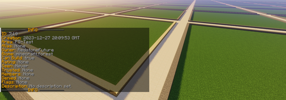

# Home

<figure></figure>

## About the plugin

PlotSquared is a land and world management plugin for Minecraft. It includes several highly configurable world generators. You can create plots of land in existing worlds using plot clusters, or you can have a full world of plots.

For the end user, PlotSquared is packed with a tonne of cool features. It allows you to merge plots, and build together with your friends. You can also change a lot of plot specific settings in the form of flags. Such as: weather, time, game modes, pvp status.

Whilst we provide a whole load of unique features, the biggest focus is to provide a lag-free and smooth experience.

* [Project Page on SpigotMC](https://www.spigotmc.org/resources/77506)
* [Projekt on GitHub](https://github.com/IntellectualSites/PlotSquared)


Learn more about the [advantages of PlotSquared](why-plotsquared.md).


## Other Links

* [Discord](https://discord.gg/intellectualsites)
* [Issues & Feature](https://github.com/IntellectualSites/PlotSquared/issues)
* [Translations](https://intellectualsites.crowdin.com/plotsquared)
